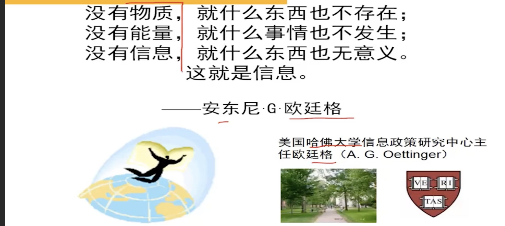

# 信息资源管理相关概念

## 信息与知识

### 信息

1. 信息的不同名字

| 国家地区   | 称呼        |
| ---------- | ----------- |
| 英文地区   | Information |
| 拉丁文地区 | Informatio  |
| 中国大陆   | 信息        |
| 港台地区   | 资讯        |

2. 信息的经典定义

| 人物       | 经典定义                                                           |
| ---------- | ------------------------------------------------------------------ |
| 哈特莱     | 信息是指有新内容，新知识的消息                                     |
| 申（香）农 | 信息是用以消除随机不确定性的东西                                   |
| 维纳       | 信息是在适应外部世界、控制外部世界的过程中同外部世界交换内容的名称 |
| 朗高       | 信息是差异                                                         |

香农（1948）

- 《通信的数学理论》----**信息论**诞生的**标志**
- 香农认为，信息是通信的内容，是“用来消除未来的某种不确定性的东西”，信息的多少反映了消除了的不确定性的大小。
- 不确定性：对客观事物的不了解、不肯定。通信的直接目的就是要消除接受端（信宿）对于发出端（信源）可能会发出哪些消息的不确定性。

维纳（1950）

- 论文《人有人的用处---控制论与社会》
- 维纳（N.Wiener）将人与外部环境交换信息的过程看成是一种广义的通信过程，认为信息是人们在适应客观世界的过程中与客观世界进行交换的内容的名称，是人与外部世界的**中介**。如果没有信息作为中介，人就会同外部世界隔绝，就不能认识世界和改造世界。

3. 信息的标准定义

从本体论的层次上考察，信息可被定义为“`事物运动的状态以及它的状态改变的方式`”；
从认识论的角度考察，`信息是主体所感知或者主体所描述的事物运动的状态以及状态变化的方式`。

从认识论的角度来看，信息被分成：`语法信息`、`语义信息`、`语用信息`。这三个信息也组成了`全信息`。

4. 对信息概念的理解

- （1）、信息是一个独立的科学概念；
- （2）、一定要分清信息概念的层次；
- （3）、信息具有“为主体消除或减少某种不确定性”的作用。

> 名词解释题：信息？
>
> 解答：信息是一个独立的科学概念。信息既不是物质，也不是能量，而是一个与物质和能力有联系又有区别的新概念。

多重分类体系（胡正荣《传播学总论》）

| 分类体系     | 信息的分类                                                                                                                                                                                                                                                                    |
| ------------ | ----------------------------------------------------------------------------------------------------------------------------------------------------------------------------------------------------------------------------------------------------------------------------- |
| 多重分类体系 | 按内容分:社会信息与非社会信息 按存在方式分:内储信息与外化信息 按动静状态分:动态信息与静态信息 按外化结果分:记录信息与非记录信息 按符号种类分:语言信息与非语言信息 按信息流通方式分:可传的信息与不作传递信息 按信息论方法分:未知信息与冗余信息 按价值观念分:有害信息与无害信息 |

宋运郊《信息活动原理》中利用`三分法体系`将信息划分了 3 种分类：按内容分、按形式分、按效用分。如下图所示:

黎鸣《信息哲学论》则有广义信息分类体系，如下图所示:

| 分类标准         | 分类结果                                                                     |
| ---------------- | ---------------------------------------------------------------------------- |
| 1.产生和作用机制 | 信息 = 自然信息 + 社会信息                                                   |
| 2.感知方式       | 信息 = 直接信息 + 间接信息                                                   |
| 3.存在形式       | 信息 = 内储信息 + 外化信息                                                   |
| 4.动静状态       | 信息 = 动态信息 + 静态信息                                                   |
| 5.符号种类       | 信息 = 语言信息 + 非语言信息                                                 |
| 6.外化结果       | 信息 = 有记录信息 + 无记录信息                                               |
| 7.流通方式       | 信息 = 可传递信息 + 非传递信息                                               |
| 8.信息方法       | 信息 = 未知信息 + 冗余信息                                                   |
| 9.价值观念       | 信息 = 有用信息 + 无用信息                                                   |
| 10.运动状态      | 信息 = 自在信息 + 自为信息 + 再生信息                                        |
| 11.物质属性      | 信息 = 广义信息 + 狭义信息                                                   |
| 12.生产力系统    | 信息 = 社会信息 + 物质信息                                                   |
| 13.记录准确性    | 信息 = 正确信息 + 错误信息                                                   |
| 14.应用领域      | 信息 = 经济信息 + 政务信息 + 文教信息 + 科技信息 + 管理信息 + 军事信息 + ... |
| 15.加工处理程度  | 信息 = 一次信息 + 二次信息 + 三次信息                                        |
| 16.信息功能      | 信息 = 功能性信息 + 非功能性信息                                             |
| 17.事物发展过程  | 信息 = 预测性信息 + 动态性信息 + 反馈信息                                    |
| 18.传递范围      | 信息 = 公开信息 + 内部信息 + 机密信息                                        |
| 19.反映事物状态  | 信息 = 常规性信息 + 偶然性信息                                               |
| 20.发布渠道      | 信息 = 正式渠道信息 + 非正式渠道信息                                         |
| 21.时态          | 信息 = 过去信息 + 未来信息                                                   |
| 22.稳定程度      | 信息 = 固定信息 + 流动信息                                                   |
| 23.范围          | 信息 = 内部信息 + 外部信息                                                   |

> 按感知方式可以将信息分为(2016.10 月单选): [B]
>
> A. 自然信息和社会信息
>
> B. 直接信息和间接信息
>
> C. 内储信息和外化信息
>
> D. 未知信息和冗余信息

5. 信息的基本特性

| 基本特性    | 含义                               |
| ----------- | ---------------------------------- |
| 1.普遍性    | 信息的存在是普遍的                 |
| 2.客观性    | 信息的内容是客观的                 |
| 3.时效性    | 具体信息都有时效                   |
| 4.传递性    | 信息是可以传递的                   |
| 5.共享性    | 信息可以被多个主体共享             |
| 6.变换性    | 信息可被加工转换成其他形态         |
| 7.转化性    | 信息可以转化成物质、能量等其他东西 |
| 8.可伪性    | 人们容易凭主观想像生成虚假信息     |
| 9.无限性    | 信息是无限的                       |
| 10.层次性   | 信息是分层次的                     |
| 11.相对性   | 认识论层次上的信息是相对的         |
| 12.知识性   | 信息具有知识的秉性                 |
| 13.转移性   | 信息可以被转移到其他载体上         |
| 14.可存储性 | 信息可以按某种方式进行存储         |
| 15.可处理性 | 信息可以被加工处理成其他形式       |
| 16.可识别性 | 信息可以被人们感知和识别           |
| 17.依附性   | 信息必须依附在某种载体上           |

6. 信息的功能

| 功能   | 含义                           |
| ------ | ------------------------------ |
| 1.前提 | 信息是人类生存的前提           |
| 2.支柱 | 信息是人类发展必需的重要资源   |
| 3.源泉 | 信息是人类一切智慧和知识的源泉 |

没有物质,就什么东西也不存在;
没有能量,就什么事情也不发生;
没有信息,就什么东西也无意义。
这就是信息。

-----安东尼·G·欧廷格

把信息和情报放在第一位,金钱就会滚滚而来。----(美国企业家)S.M.沃尔森----来源:《细节决定成败》(汪中求著)

### 知识

1. 知识的定义

> 名词解释： 知识（2014.10 月）
>
> 解答: 经过人的思维整理过的信息、数据、形象、意象、价值标准以及社会的其他符号化产物。

2. 知识与信息的关系

| 观点   | 含义               |
| ------ | ------------------ |
| 观点 1 | 知识是信息的一部分 |
| 观点 2 | 信息是知识的一部分 |
| 观点 3 | 知识与信息有区别   |

关系如下图所示:

3. 知识的特性

| 特性       | 含义                           |
| ---------- | ------------------------------ |
| 1.智慧性   | 知识是人类智慧的结晶           |
| 2.客观性   | 知识是人脑对信息加工的客观成果 |
| 3.依附性   | 所有知识都有载体               |
| 4.不磨损性 | 知识在使用过程中不发生磨损     |
| 5.非遗传性 | 知识不能通过血缘关系进行遗传   |
| 6.增值性   | 知识有不断被丰富和充实的可能性 |
| 7.共享性   | 知识可以被其他人共享使用       |

4. 知识的分类

OECD（经济合作与发展组织，Organization for Economic Co-operation and Development）

> OECD 是指(2016.10 月单选)：[B]
>
> A 国际标准化组织
>
> B 世界经济合作与发展组织
>
> C 世界经济贸易组织
>
> D 国际信息化中心

4.1. 知识的科学分类方法

| 分类标准 | 分类结果                                      |
| -------- | --------------------------------------------- |
| 1.领域   | 知识=哲学知识+社会科学知识+自然科学知识       |
| 2.用途   | 知识=科学知识+技术知识+文化知识(2015.10 单选) |
| 3.状态   | 知识=存量知识+流量知识                        |
| 4.水平   | 知识=低级知识+中级知识+高级知识               |
| 5.性质   | 知识=普通知识+专业知识                        |
| 6.载体   | 知识=隐性知识+显性知识                        |

> 名词解释:隐性知识和显性知识
>
> 隐性知识:高度个性化且难于格式化的知识
> 显性知识:能用文字和数字表达出来(即可通过正常的语言方式来传播的知识),容易以硬数据的形式交流和共享,并且经编辑整理的程序或者普遍原则

> 显性知识"是指(2014.4 月单选)[A]
>
> A.可通过正常的语言方式来传播的知识
>
> B.只能通过书写方式来传播的知识
>
> C.只能通过图形的方式来传播的知识
>
> D.深层次的,个人拥有的知识

4.2. OECD 的知识分类方法

| OECD 分类(简答)         | 含义                                    | 举例                     |
| ----------------------- | --------------------------------------- | ------------------------ |
| 1.知事类知识(Know What) | 关于事物或者事实方面的知识              | "街头状元榜"栏目问题     |
| 2.知因类知识(Know Why)  | 关于科学原理以及自然规律的知识          | 牛顿的万有引力定律       |
| 3.知能类知识(Know How)  | 做事的技巧和能力,包括技术、技巧和决窍等 | 人事经理招聘员工的技能等 |
| 4.知人类知识(Know Who)  | 包括谁知道什么的信息等                  | 专家网络知识             |

> 知能类知识(Know-how)是指(2014.4 月单选)[C]
>
> A.关于事实方面的知识
>
> B.客观事物变化、发展的原因与规律的知识
>
> C.处理事物的能力的知识
>
> D.与他人关系的知识

吴季松等人在 OECD 提出的上述四类知识的基础上,又加上知时类知识(Know When)、知地类知识(KnowWhere)和知数类知识(KnowQuantity)。这就是所谓具有中国特色的知识分类,可以用公式简记为:`K = 6W + Q`。

> DECD 关于知识的四种分类是(2014.10 月单选)[A]。
>
> A. 知事、知因、知能、知人
>
> B. 知往、知今、知未、知因
>
> C. 知资、知力、知度、知人
>
> D. 知因、知果、知力、知度

1.黄方程

中国科学院固体物理学家黄昆研究极性晶体的光学振动模,提出一对唯象的方程。

2.陈氏定理

中国科学院数学家陈景润证明哥德巴赫猜想的论文。

3.吴文俊公式

中国科学院数学家吴文俊 1950 年发现的关于示性类公式。

4.华-王方法

中国科学院数学家华罗庚、王元在筛法及其应用中所作出的成果。

5.龚氏物质

中国科技大学生物系教授龚立兰人工合成的两种新物质均以他的姓名命名。

6.朱-刘算法

中国科学院数学家朱永津和刘振宏提出最小树形圆算法。

7.夏不等式

中国复旦大学教授夏道行在泛涵分析方面取得的突出成果(夏道行函数与夏道行不等式)。

8.吴氏方程

著名工程物理学家吴仲华在国际上创立的叶轮机械三元流动理论。

> (1). 知识和人力资本是新经济增长理论中的核心内容。
> (2). 生产过程中的知识产出具有重要的现实意义。

## 资源与信息资源

### 资源

1. 资源的定义

在一定的科学技术条件下,能够在人类社会经济活动中用来创造物质财富和精神财富并达到一定量的客观存在形态。

> 现代社会发展的三大资源是(2016.10 月单选)[D]。
>
> A. 材料、人、信息
>
> C. 人、信息、技术
>
> B. 能源、人、信息
>
> D. 材料、能源、信息

2. 资源的属性

| 属性         | 含义                                         |
| ------------ | -------------------------------------------- |
| 1.质量规定性 | 资源具有质和量的规定性                       |
| 2.有效性     | 资源必须具有开发和利用的价值                 |
| 3.有限性     | 作为供体的资源总是被消耗的,是有限的          |
| 4.多宜性     | 任何一种资源都具有多功能、多用途和多效益特征 |
| 5.时空性     | 资源具有时间性和空间性                       |

3.资源的分类

| 分类标准                   | 分类结果                        |
| -------------------------- | ------------------------------- |
| 1.经济学角度               | 资源=不可再生资源+可再生资源    |
| 2.其他学科角度             | 资源=自然资源+社会资源          |
| 3.在人类社会生产中所起作用 | 资源=物质资源+能量资源+信息资源 |

> 如果我们人类所有的机器和工具都被破坏了,而图书馆还存在着,那么人类仍然能够重新发展起来;如果图书馆连同所有的机器和工具一起都被破坏了,那么人类文明的重新出现,就会是几千年以后的事了。---卡尔·波普尔

> 卡尔·波普尔是 20 世纪最重要的思想家、哲学家。他的思想和作品从 1970 年代末开始被介绍到我国。

#### 信息资源

1. 信息资源的含义

国内外大多数研究专家都认为,应该从狭义和广义两种角度来认识和理解信息资源的含义。

2. 信息资源的特征

| 特征       | 含义                                                 |
| ---------- | ---------------------------------------------------- |
| 1.需求性   | 现代信息经济活动主要依赖于信息资源的投入             |
| 2.稀缺性   | 信息资源的拥有量总是有限的                           |
| 3.可选择性 | 同一信息资源可以作用于不同的对象上并且产生不同的效果 |
| 4.共享性   | 信息资源可以为他人共享使用                           |
| 5.不可分性 | 信息资源在生产和使用过程中是不可分的                 |
| 6.不同一性 | 信息资源集合中的每一种信息都具有独特的性质           |
| 7.可驾驭性 | 信息资源具有开发和驾驭其他资源的能力                 |
| 8.动态性   | 信息资源是随时间变化而变化的动态资源                 |

其中信息资源的经济学特征包含：需求性、稀缺性、可选择性。其中稀缺性是最基本的经济学特征。信息资源的独有特征包含：共享性、不可分性、不同一性、可驾驭性、动态性。共享性是信息资源的本质特征。

> 单选(2016.10)下面不属于信息资源的独有特征的是[B]。
>
> A.共享性
>
> B.稀缺性
>
> C.驾驭性
>
> D.动态性

> 稀缺性:信息资源的经济学特征之一(2015.10)

3. 信息资源的分类

3.1 广义信息资源的分类

| 分类标准   | 分类结果                                                         |
| ---------- | ---------------------------------------------------------------- |
| 1.组成关系 | 广义信息资源=元信息资源+本信息资源+表信息资源                    |
| 2.具体形态 | 广义信息资源=有形信息资源+无形信息资源                           |
| 3.空间位置 | 广义信息资源=国际信息资源+国家信息资源+地区信息资源+单位信息资源 |

> 广义信息资源包括(2014.10 月多选)[ABCDE]。
>
> A.信息本身
>
> B.信息载体
>
> C.信息采集能力
>
> D.信息采集的发展潜力
>
> E.信息采集方法

3.2 狭义信息资源的分类

| 分类标准       | 分类结果                                                                                   |
| -------------- | ------------------------------------------------------------------------------------------ |
| 1.开发利用程度 | 狭义信息资源=成品信息资源+半成品信息资源+档案信息资源+动态信息资源+消费型信息资源          |
| 2.加工程度     | 狭义信息资源=一次信息资源+二次信息资源+三次信息资源                                        |
| 3.开发管理角度 | 狭义信息资源=记录型信息资源+实物型信息资源+智力型信息资源+零次信息资源                     |
| 4.感官作用     | 狭义信息资源=视觉信息资源+听觉信息资源+视听信息资源+触觉信息资源                           |
| 5.传递范围     | 狭义信息资源=公开信息资源+半公开信息资源+非公开信息资源                                    |
| 6.产生领域     | 狭义信息资源=社会信息资源+自然信息资源                                                     |
| 7.存储介质     | 狭义信息资源=口头信息资源+书面信息资源+视听信息资源+缩微信息资源+机读型信息资源            |
| 8.社会属性     | 狭义信息资源=政治信息资源+军事信息资源+科技信息资源+经济信息资源+社会信息资源+生产信息资源 |
| 9.时态         | 狭义信息资源=历史信息资源+现代信息资源+预测信息资源                                        |
| 10.性质        | 狭义信息资源=逻辑思维信息资源+形象情感信息资源+知识信息资源+控制信息资源                   |
| 11.有序程度    | 狭义信息资源=有序信息资源+准有序信息资源+无序信息资源                                      |
| 12.地位作用    | 狭义信息资源=能源与材料信息资源+技术信息资源+管理信息资源                                  |

3.3 新型信息资源

| 名称             | 含义                                                                                                                                                                        |
| ---------------- | --------------------------------------------------------------------------------------------------------------------------------------------------------------------------- |
| 1.多媒体信息资源 | 将声音、图像、通信等在内的多种媒体功能有机结合在一起的新媒体资源                                                                                                            |
| 2.电子出版物     | 以电子信息方式将图文等多种形式的信息存储在磁光载体中,然后用计算机或其他电子通信方式读出                                                                                     |
| 3.网络信息资源   | 是指以网络为纽带联结起来的信息资源和以网络为主要交流、传递、存储手段与形式的信息资源,可以进一步细分为交流型网络信息资源、交易型网络信息资源、公告栏网络信息资源等三种类型。 |

> 判断: 从资源在人类社会生产中所起的作用划分,可以将资源划分为物质资源,能量资源以及信息资源三种类型。(2016.10) ✅
>
> 判断:信息资源属于不可再生资源(2014.4 月) ❌ 信息资源属于可再生资源

## 基于数据量的信息度量

基于数据量的信息度量方法:它是计算机信息处理工作中的一种常用信息度量方法,按反映信息内容的数据所占用计算机存储装置的存储空间大小来衡量信息量的大小。

### 基于数据量的信息度量单位

| 英文名称    | 英文简称 | 中文名称 | 中文别称 |
| ----------- | -------- | -------- | -------- |
| 1. Bit      | b        | 比特     | 位       |
| 2. Byte     | B        | 字节     |          |
| 3. KiloByte | KB       | 千字节   |          |
| 4. MegaByte | MB       | 兆字节   | 百万字节 |
| 5. GigaByte | GB       | 千兆字节 | 吉字节   |
| 6. TeraByte | TB       | T 字节   |          |
| 7. PetaByte | PB       | P 字节   |          |
| 8. ExaByte  | EB       | E 字节   |          |

$$
1 \, \text{B} = 8 \, \text{bit}
$$

$$
1 \, \text{KB} = 1024 \, \text{B} = 2^{10} \, \text{B} \approx 10^{3} \, \text{B}
$$

$$
1 \, \text{MB} = 1024 \, \text{KB} = 1048576 \, \text{B} = 2^{20} \, \text{B} \approx 10^6 \, \text{B}
$$

$$
1 \, \text{GB} = 1024 \, \text{MB} = 1073741824 \, \text{B} = 2^{30} \, \text{B} \approx 10^9 \, \text{B}
$$

$$
1 \, \text{TB} = 1024 \, \text{GB} = 1099511627776 \, \text{B} = 2^{40} \, \text{B} \approx 10^{12} \, \text{B}
$$

$$
1 \, \text{PB} = 1024 \, \text{TB} = 1125899906842624 \, \text{B} = 2^{50} \, \text{B} \approx 10^{15} \, \text{B}
$$

$$
1 \, \text{EB} = 1024 \, \text{PB} = 1152921504606846976 \, \text{B} = 2^{60} \, \text{B} \approx 10^{18} \, \text{B}
$$

> (2014.4 月)多选:基于数据量的信息度量单位主要有[ABC]。
>
> A. 千字节 ✅
>
> B. 兆字节 ✅
>
> C. 千兆字节 ✅
>
> D. 哈特 [基于概率的信息度量单位](#基于概率的信息度量)
>
> E. 奈特 [基于概率的信息度量单位](#基于概率的信息度量)

> 判断: 1 GB = 1000 MB。(2014.10 月) ❌ **1 GB = 1024 MB**

### 基于概率的信息度量

平均信息量的公式为：

$$
H(X) = - \sum_{i=1}^{n} P_i \log_2 P_i
$$

基于概率的信息度量单位：

| 中文名称     | 英文简称 | 定义            |
| ------------ | -------- | --------------- |
| 1.比特(香农) | bit      | $\log_{2}{2}$   |
| 2.奈特       | nat      | $\log_{e}{e}$   |
| 3.哈特       | hart     | $\log_{10}{10}$ |

### 广义信息资源的度量

信息资源丰裕度度量方法:中国人民大学的陈禹教授等人提出的一种较好的广义信息资源度量方法,它选择信息资源中的若干重要内容进行度量,较好地反映了被评测国家或地区信息资源的生产储备能力与发展潜力,并且其计算方法较简明,可以较方便地取得有关数据。

$$
R = R_1 + R_2
$$

$$
R_1=\frac{U_1+U_2+U_2+U_3+U_4}{M}
$$

$$
R_2=S_1 + S_2
$$

$$
S_1=\frac{V_1 + V_2 + V_3 + V_4 + V_5 + V_6}{M}
$$

$$
S_2=\frac{W_1 + W_2 + W_3 + W_4 + W_5}{M}
$$

> 1."显性知识"是指(A)。
>
> A.可通过正常的语言方式来传播的知识
>
> B.只能通过书写方式来传播的知识
>
> C.只能通过图形的方式来传播的知识
>
> D.深层次的,个人拥有的知识
>
> 解析:(P13)。本题主要考查的知识点是显性知识的概念。所谓显性知识(又叫明确知识),就是"能用文字和数字表达出来,容易以硬数据的形式交流和共享,并且经编辑整理的程序或者普遍原则"。概括起来,显性知识是指用文字、语言、图形等表现出来的知识。
>
> 知能类知识(Know-how)是指(C)。
> A.关于事实方面的知识
>
> B.客观事物变化、发展的原因与规律的知识
>
> C.处理事物的能力的知识
>
> D.与他人关系的知识
>
> 解析:(P14)本题主要考察的知识点是知能类知识的概念。知能类知识是指做事的技巧和能力,包括技术、技巧和诀窍等。
>
> 3.事物运动的状态以及它的状态改变的方式被称为(B)。
>
> A.流言
>
> B.信息
>
> C.消息
>
> D.物质
>
> 解析:(P3)。在历届考试中还会以名词解释题的形式出现,本题主要考察信息的概念,信息是一个独立的科学概念。信息既不是物质,也不是能量,而是一个与物质和能量既有联系又有区别的新概念。
>
> 4.信息资源属于(A)。
>
> A.可再生资源
>
> C.不可利用资源
>
> B.不可再生资源
>
> D.无用资源
> 解析:(P19)。本题在历届考试中还会以判断改错题的形式出现。可再生资源是指经过人的努力在数量和质量上都可以增加或改善的资源,信息资源属于可再生资源。
> 5.OECD 关于知识的四种分类是(A)。
>
> A.知事、知因、知能、知人
>
> C.知往、知今、知未、知因
>
> B.知资、知力、知度、知人
>
> D.知因、知果、知力、知度
>
> 解析:(P13)。1996 年,经济合作与发展组织在题为"以知识为基础的经济"的报告中,为了便于进行经济分析,将对经济发展有重重要推动作用的知识分为知事类知识、知因类知识、知能类知识、知人类知知识四种类型。
>
> 6.广义信息资源不包括(F)。
> A.信息本身
>
> B.信息载体
>
> C.信息采集能力
>
> D.信息采集的发展潜力
>
> E.信息采集方法
>
> F.信息消费者
>
> 解析:(P21)。从广义角度理解,广义信息资源是信息和它的生产者以及信息技术的集合。也就是说,广义信息资源一般由 3 部分构成:一是人类社会经济活动中经过加工处理有序化并大量积累后的有用信息的集合,二是为某种目的而生产有用信息的信息生产者的集合,三是加工、处理和传递有用信息的信息技术的集合。
> 现代社会发展的三大资源是(D)。
> A.材料、人、信息
>
> B.能源、人、信息
>
> C.人、信息、技术
>
> D.材料、能源、信息
>
> OECD 是指(B)。
>
> A.国际标准化组织(ISO)
>
> B.世界经济合作与发展组织
>
> C.世界经济贸易组织(WTO)
>
> D.国际信息化中心
>
> 1.按美国学者波拉特的观点划分,下列哪些行业不可划归到信息产业当中?【B】
> A.教育
>
> B.体育
>
> C.广播电视
>
> D.保险业
>
> 解析:(P46)。波拉特将信息产业分成三大部分,即:`供给信息的市场`(包括研究与开发、教育、咨询服务、审计、广播、电视、报纸、杂志、书籍的印刷与发行等行业)、`市场的信息`(包括宣传告业、工会、专家组织、商会、政治团体、金融业、保险业等)以及`信息的基础建设`(包括信息处理与传递服务业、信息产品制造业、信息产品的批发与零售业,以及为信息活动提供支持的设施)。(此知识点在历年真题中还以多选题形式出现)
>
> 2.事物运动的状态以及它的状态改变的方式被称为【B】
>
> A.流言
>
> B.信息
>
> C.消息
>
> D.物质
>
> 解析:(P3)。本题主要考察信息的概念,在历届考试中还会以名词解释题的形式出现。信息是一个独立的科学概念。信息既不是物质,也不是能量,而是一个与物质和能量既有联系又有区别的新概念。
>
> 3.从经济学的角度人类社会三个发展阶段中的第二个阶段是【C】
> A.农业经济阶段
>
> B.知识经济时代
>
> C.工业经济阶段
>
> D.信息经济阶段
>
> 解析:(P52)。从经济学的角度来分析,人类社会可分为三个发展阶段,第一阶段是`农业经济阶段`,第二阶段是`工业经济阶段`,第三阶段是`知识经济阶段`
>
> 4.知识经济的效率标准是【B】
>
> A.劳动生产率
>
> B.知识生产率
>
> C.投资回报率
>
> D.GDP
>
> 解析:(P52)。OECD 给出的知识经济定义是:知识经济是建立在知识和信息基础之上的经济,以知识和信息的生产(creation)、分配(distribution)和应用(use)为直接依据的经济,知识是`提高生产率`和实现经济增长的驱动器。
>
> 5.OECD 关于知识的四种分类是【A】
>
> A.知事、知因、知能、知人
>
> C.知往、知今、知未、知因
>
> B.知资、知力、知度、知人
>
> D.知因、知果、知力、知度
>
> 解析:(P13)。1996 年,经济合作与发展组织在题为"以知识为基础的经济"的报告中,为了便于进行经济分析,将对经济发展有重要推动作用的知识分为`知事类知识`、`知因类知识`、`知能类知识`、`知人类知识`四种类型。

### 信息化与国家信息化

#### 信息化及相关概念

| 概念         | 含义                                                                                                                                                           |
| ------------ | -------------------------------------------------------------------------------------------------------------------------------------------------------------- |
| 1.信息化     | 人们信息活动的规模不断增长以至在国民经济中占主导地位的过程                                                                                                     |
| 2.国家信息化 | 在国家统一规划和组织下,在农业、工业、科学技术、国防及社会生活各个方面应用现代信息技术,深入开发、广泛应用信息资源,加速国家实现现代化的进程(名词解释:2016.10 月) |

#### 信息化建设及其社会经济意义

#### 信息化的不同发展模式

#### 信息化的组成要素及其相互关系

#### 中国信息化的主要任务

### 产业与信息产业

### 知识经济与知识管理

[知识点](https://blog.csdn.net/QIU176161650/article/details/126437417)。

[考题](https://max.book118.com/html/2024/0628/8003132120006104.shtm)。